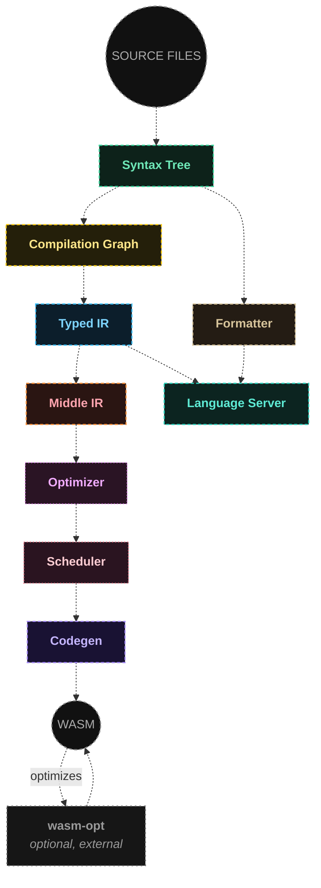

<p align="center">
  <picture>
    <source media="(prefers-color-scheme: dark)" srcset="banner.svg">
    <source media="(prefers-color-scheme: light)" srcset="banner-light.svg">
    
  </picture>
</p>

<h1 align="center">
WX - Web Assembly Expressive Language
</h1>

WX is a Rust-inspired language that compiles directly to WebAssembly. It stays close to the WASM spec instead of hiding it, so the code you write maps predictably onto the module you get — no hidden runtime, no surprises.

This project is part of my bachelor's thesis exploring what it takes to build a full WASM compiler from scratch. It's still early — expect rough edges.

## Features

- **Rust-inspired syntax** — structs, traits with default methods and associated types, generics, `impl` blocks. Familiar if you already know Rust, with a much smaller surface to learn.
- **Predictable, low-abstraction codegen** — nothing allocates or runs behind your back; struct fields are automatically alignment-sorted to minimize padding. What you write maps closely onto the bytes you get.
- **Zero-cost generics** — trait-based monomorphization, plus inlining and dead-code elimination to keep the output lean.
- **Full control over your module's memory and boundary** — you decide exactly what your program exposes to (and pulls in from) its host.
- **A custom optimizer** — our own sea-of-nodes-based optimizer, though it doesn't follow the design in every detail. Still a work in progress, but already functional.
- **WASI Preview 1 support** — bindings and examples for args, file I/O, and randomness, so you can write real programs against a real ABI, not just arithmetic toys.
- **Tooling that works today** — an LSP with diagnostics/completions/go-to-definition/formatting behind a real VS Code extension, plus an in-browser playground compiled to WASM itself.

## Getting Started

Try it instantly in the browser playground: [wx-lang.deno.dev](https://wx-lang.deno.dev/)

**Install the CLI from npm**

```bash
npm install -g @wx-lang/cli

wx build .   # run inside a project directory containing wx.json + your entry file
```

**Or build the native CLI from source**

```bash
cargo build --release -p wx-cli
./target/release/wx build .
```

**Editor support**

Search for "WX" in the VS Code Extensions view for syntax highlighting, diagnostics, completions, and formatting. Other editors aren't supported yet.

## Examples

Sample programs live in the [`examples`](examples) directory.

## Architecture



### Pipeline stages

- **Syntax Tree (AST)** — `ast::Parser::parse()`. Lexes and parses one file's source text into a syntax tree.
- **Compilation Graph (VFS)** — `vfs::CompilationGraphBuilder`. Parses and assembles every file into a `CompilationGraph`; always loads `std/main.wx` first (`load_stdlib()`), then the user's files (`load_binary()`), enabling multi-file module compilation.
- **Typed IR (TIR)** — `tir::TIR::build()`. Type checking, name resolution, and semantic validation across the whole compilation graph.
- **Middle IR (MIR)** — `mir::MIR::build()`. Desugaring, monomorphization, and inlining + dead-code elimination.
- **Optimizer (OPT)** — `opt::builder::Builder::build()`, run per function from inside codegen. Builds a sea-of-nodes SSA graph for optimization.
- **Scheduler** — `opt::scheduler::Scheduler::schedule()`. Schedules the SSA graph into a linear `ScheduledFunction`.
- **Codegen** — `codegen::Builder::build()`. Drives the optimizer and scheduler for every function, then encodes the WASM module bytecode.
- **Formatter (FMT)** — the `wx-fmt` crate. Pretty-prints straight from the syntax tree (no type information needed); used by `wx format` and the language server's formatting request.
- **Language Server (LSP)** — the `wx-lsp` crate. Reads the syntax tree and typed IR for diagnostics/completion/go-to-definition, and calls into the formatter for formatting requests.
- **wasm-opt (optional)** — an external [Binaryen](https://github.com/WebAssembly/binaryen) tool. Not invoked by `wx` itself; run it manually on the emitted `.wasm` file for production builds. For everyday development, the native optimizer/scheduler pipeline is enough — reach for `wasm-opt` when shipping.

## Credits

Here are some of the resources I used to learn about compilers and wasm while working on this project:

- [Youtube channel of Julian Hartl](https://www.youtube.com/channel/UCFRB-SI9q_p5Erjsj-EpOGw)
- [Youtube channel of Jon Gjengset](https://www.youtube.com/@jonhoo)
- [Youtube channel of Tyler Laceby](https://www.youtube.com/@tylerlaceby)
- [Simple but Powerful Pratt Parsing by Alex Kladov](https://matklad.github.io/2020/04/13/simple-but-powerful-pratt-parsing.html)
- [WASM IO conference talks](https://www.youtube.com/@wasmio)
- Youtube channels with recordings of rust conferences like [Rust NL](https://www.youtube.com/@rustnederlandrustnl) and [EuroRust](https://www.youtube.com/@eurorust)
- [Conference talks of Andrew Kelley](https://andrewkelley.me/)
- [rats159](https://www.youtube.com/@awesome.rats159)
- [Allocation Strategies by gingerBill](https://www.youtube.com/watch?v=BxLEymP1f6o)